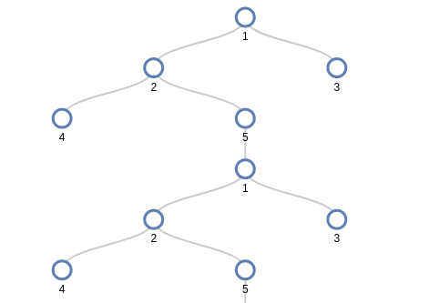
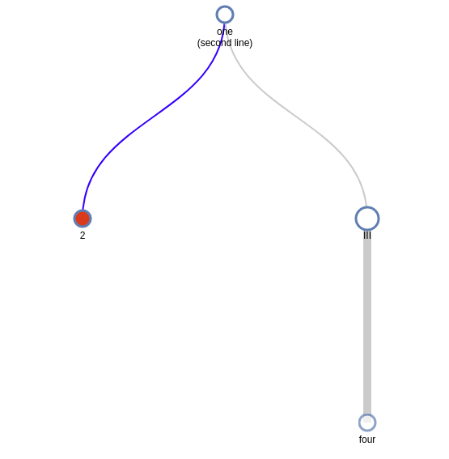
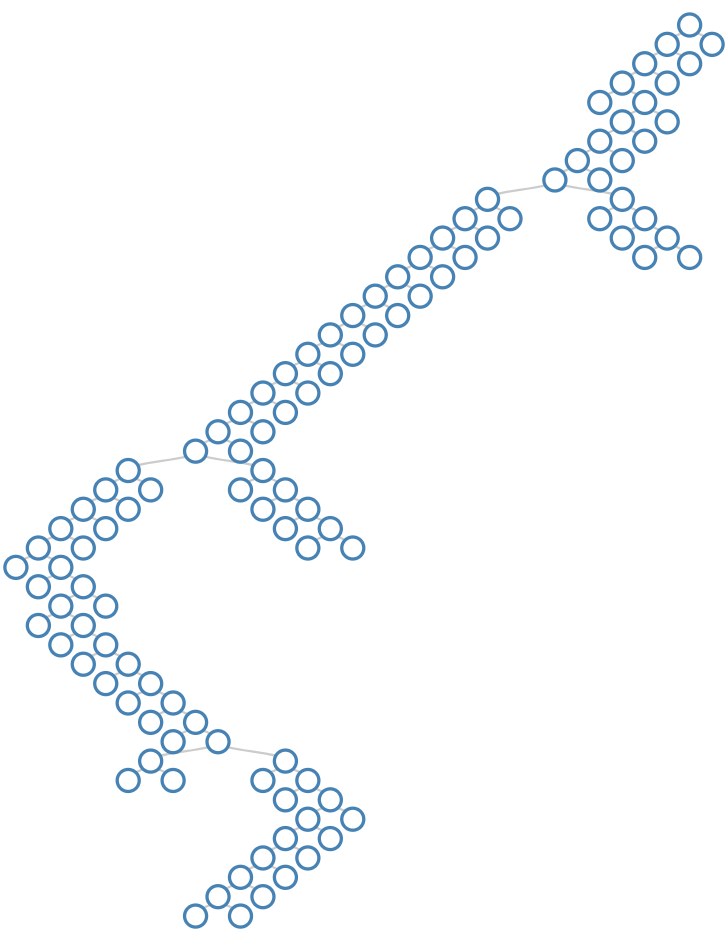

# D3Trees

[](https://github.com/sisl/D3Trees.jl/actions/workflows/CI.yml)
[](https://codecov.io/gh/sisl/D3Trees.jl)

Flexible interactive visualization for large trees using [D3.js](d3js.org).



## Installation

```julia
Pkg.add("D3Trees")
```

## Basic Usage

There are two ways to create a D3Tree object described below:

### 1) With AbstractTrees

Any object that implements the interface from AbstractTrees can be given to the constructor: `D3Tree(object)`.

See the docstring (`julia> ?D3Tree`) for information on how to control the style.

### 2) Without AbstractTrees

The structure of a D3Tree is specified with *lists of children for each node* stored in a `Vector` of `Int` `Vector`s. For example,

```julia
D3Tree([[2,3], [], [4], []])
```

creates a tree with four nodes. Nodes 2 and 3 are children of node 1, and node 4 is the only child of node 3. Nodes 2 and 4 are childless.

## Displaying Trees

In an IJulia notebook, the tree will automatically be displayed using D3.js. To get an interactive display in a chrome browser from the repl or a script, you can use the `inchrome` function. The `blink` function can also open it in a standalone window using the `Blink.jl` package.

```julia
children = [[2,3], [4,5], [6,7], [8,9], [1], [], [], [], []]
t = D3Tree(children)

inchrome(t)
inbrowser(t, "firefox")
```

By clicking on the nodes, you can expand it to look like the image at the top of the page.

## Style Control

Optional arguments control other aspects of the style (use `julia> ?D3Tree` for a complete list), for example,

```julia
children = [[2,3], [], [4], []]
text = ["one\n(second line)", "2", "III", "four"]
style = ["", "fill:red", "r:14", "opacity:0.7"]
link_style = ["", "stroke:blue", "", "stroke-width:10px"]
tooltip = ["pops", "up", "on", "hover"]
t = D3Tree(children,
           text=text,
           style=style,
           tooltip=tooltip,
           link_style=link_style,
           title="My Tree",
           init_expand=10)

inchrome(t)
```

will yield



or, see [examples/hello.ipynb](https://nbviewer.jupyter.org/github/sisl/D3Trees.jl/blob/master/examples/hello.ipynb)

## Lazy loading trees

Deep trees can be expanded on demand from the visualization by clicking on unexpanded nodes. For example, see [examples/LazyLoadDeepTrees.ipynb](https://nbviewer.jupyter.org/github/sisl/D3Trees.jl/blob/master/examples/LazyLoadDeepTrees.ipynb)

The lazy loading can be controlled through two main keyword arguments:

- `lazy_expand_after_depth` which controls the initial expansion depth of the tree, before being sent as json to the visualization,
- `lazy_subtree_depth` which determines the depth of on-demand expanded subtrees.

```julia
# very deep tree
ldroot = LimitedDepthTree()
# launches visualization and click some nodes
D3Tree(ldroot, lazy_expand_after_depth=0,  lazy_subtree_depth=1)
```

can then be expanded to a following tree by clicking on leafs:



## Text output

D3Trees also supports basic text output. This can be achieved by writing to an io object with the `text/plain` mime. This format is the automatic output if a D3Tree is created in the REPL:

```julia
julia> children = [[2,3], [4,5], [6,7], [8,9], [1], [], [], [], []];

julia> t = D3Tree(children)
1
├──2
│  ├──4
│  │  ├──8 (0 children)
│  │  └──9 (0 children)
│  └──5
│     └──1 (2 children)
└──3
   ├──6
   └──7
```

## Browser compatibility

This package works best in the Google Chrome or Chromium browser.

## Limitations

- This will not work offline because it downloads the D3 library on the fly (<https://github.com/sisl/D3Trees.jl/issues/10>)
